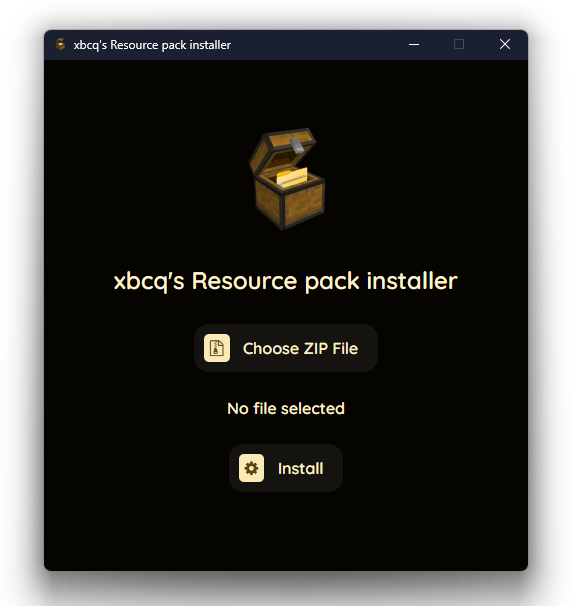

# 🎨 Minecraft Resource Pack Installer  

A **simple, fully open-source, unique, and user-friendly** Electron-based app to install resource packs for Minecraft effortlessly.  

## ✨ Features  
- 🖌 **Drag & Drop** resource packs into the app  
- ⚡ **One-click install** to the correct Minecraft folder  
- 🎨 **Modern, sleek UI** for a smooth experience  
- 🔄 **Works with all Minecraft versions** that support resource packs  

## 🚀 Installation  
1. Clone the repository:  
   `git clone https://github.com/xbcq1490/xbcq-s-Resource-pack-installer.git`  
   `cd src`  
2. Install dependencies:  
   `npm i`  
3. Run the app:  
   `npm start`
   
Build an executable using electron-packager (Optional) 
   `npm run build`  

## 📖 How to Use  
1. Open the app.  
2. Select the **.zip** resource pack file into the window.  
3. Click **"Install"**, and it will be placed in your Minecraft resource packs folder.  
4. Open Minecraft, go to **Options > Resource Packs**, and activate it!  

## 📜 License  
[MIT License](LICENSE) – Modify freely, but **please give credit**!  

---

🌟 **Enjoy your customized Minecraft experience!** 🚀  
